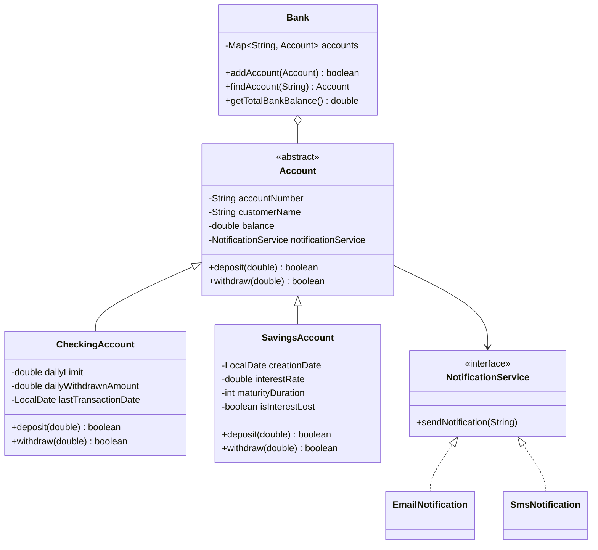

# Banking Management System

A console-based banking application developed in Java to practice object-oriented design, business-rule validation, data integrity, and maintainable application structure.

This project was built during my supervised software engineering internship at **ANKAREF İnovasyon ve Teknoloji A.Ş.** and focuses on translating banking rules into clear, testable program behavior.

## Overview

The system manages two account types — **CheckingAccount** and **SavingsAccount** — through a common abstract `Account` model. It supports account creation, deposits, withdrawals, account lookup, balance reporting, maturity rules, daily withdrawal limits, and notification preferences.

## Key Features

- Create checking and savings accounts
- Prevent duplicate account numbers
- Deposit and withdraw money with validation
- Enforce checking-account daily withdrawal limits
- Automatically reset the daily withdrawal counter when the date changes
- Apply savings-account maturity rules and interest behavior
- Forfeit interest after premature withdrawal
- Select SMS or e-mail notifications through a common interface
- Store and retrieve accounts with a `HashMap`
- Validate names, account-number format, numeric inputs, and transaction amounts
- Display registered accounts and total bank balance

## Design & Engineering Decisions

### Object-oriented account model

`Account` is an abstract base class containing shared account state and transaction behavior. `CheckingAccount` and `SavingsAccount` extend it and override operations where their business rules differ.

This keeps common behavior centralized while allowing account-specific rules to evolve independently.

### Encapsulated balance state

The account balance is kept `private` inside `Account`. Subclasses cannot modify it directly and must use the validated `deposit()` and `withdraw()` operations.

This was a deliberate design decision to reduce uncontrolled state changes and preserve data integrity.

### Polymorphic transaction flow

The application works with `Account` references rather than depending directly on concrete account classes. Deposit and withdrawal calls therefore use the appropriate overridden behavior at runtime.

### Notification abstraction

Notifications are represented by the `NotificationService` interface, with `EmailNotification` and `SmsNotification` implementations. Accounts depend on the interface rather than a concrete notification type.

Notifications are triggered only after successful transactions, preventing failed operations from producing misleading user messages.

### Date-based business rules

The project uses `java.time.LocalDate` for time-dependent rules:

- checking-account withdrawal totals reset when the calendar day changes;
- savings-account maturity dates are calculated from the account creation date and maturity duration.

## Architecture



## Project Structure

```text
src/
├── Account.java
├── Bank.java
├── CheckingAccount.java
├── SavingsAccount.java
├── NotificationService.java
├── EmailNotification.java
├── SmsNotification.java
└── Main.java
```

## Technologies

- Java
- Java Standard Library
- `java.util.HashMap`
- `java.time.LocalDate`
- IntelliJ IDEA
- JDK 21 development environment

No database, framework, or third-party dependency is required.

## Running the Project

Clone the repository and run the following commands from the project root:

```bash
mkdir out
javac -d out src/*.java
java -cp out Main
```

The application starts an interactive console menu for creating accounts and performing transactions.

## What I Practiced

This project strengthened my understanding of:

- abstraction, inheritance, encapsulation, interfaces, and polymorphism;
- translating business requirements into validation rules;
- separating shared behavior from account-specific behavior;
- collection-based object management with `HashMap`;
- date-dependent application logic with `LocalDate`;
- defensive input validation and transaction-state control;
- iterative refactoring based on testing and review.

## Current Limitations & Possible Improvements

The project is intentionally lightweight and currently uses in-memory storage and manual console-based testing. Possible next steps include:

- persistent storage or a database;
- automated unit tests with JUnit;
- custom exception types for business-rule failures;
- monetary values based on `BigDecimal` instead of `double`;
- a clearer separation between console UI and business/application logic;
- additional account types and transaction history.

---

**Author:** Emire Güngör  
Software Engineering Student — OSTİM Technical University
